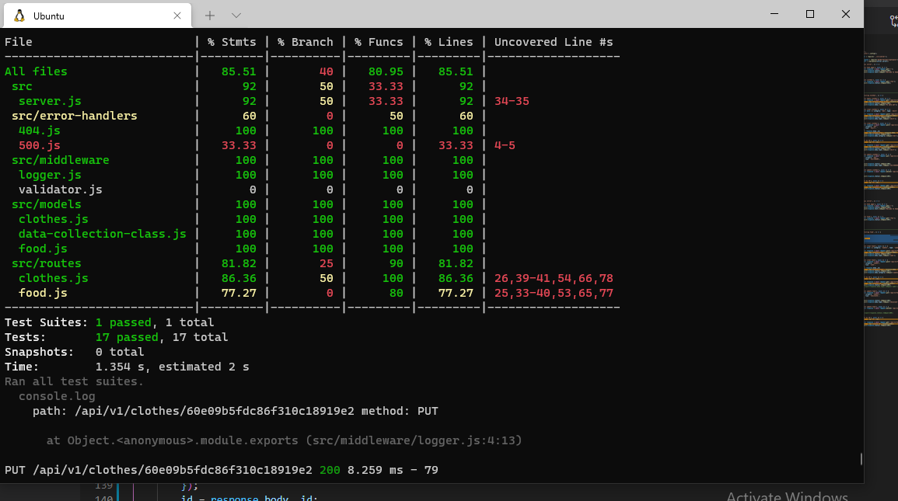
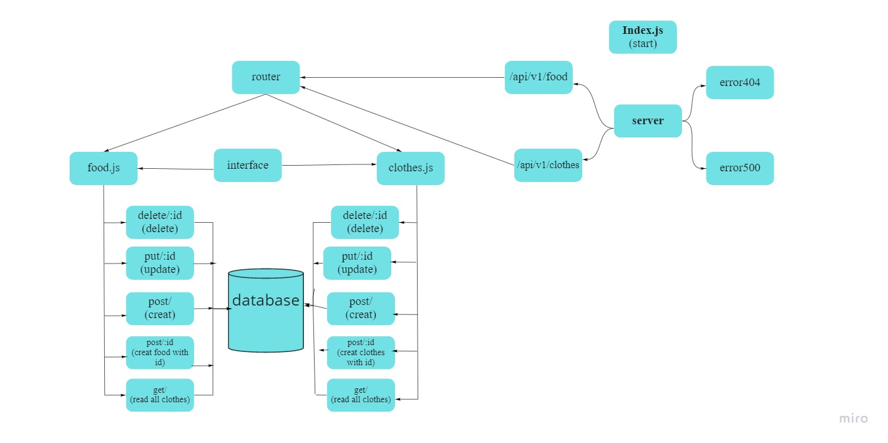

# Api-Server

 A REST Express API, with varity end endpoints that perform CRUD operations on a Mongo DataBase, using the REST standerds. there is a data models with two routes: clothes, food.
****
# Author: 
### Enas Batayneh
****
## Links

* [Pull request](https://github.com/En-ZUH/api-server/pulls)
* [Github Actions](https://github.com/En-ZUH/api-server/actions/new)

* [Deployed App to Heroku /production](https://api-server-enas.herokuapp.com/)

## Setup

* express  
* (.env) file
  * PORT 
  * MONGOOSE_URL

## Dependencies needs to install

* npm init -y
* npm i dotenv express cors morgan mongoose
* npm i -D jest supertest eslint
* npm i @code-fellows/supergoose
* sudo service mongodb start

## To Run the Application

1. clone the repository
2. run the command (nodemon)

## File Structure
```
├── LICENSE
├── README.md
├── __tests__
│   └── server.test.js
├── index.js
├── package-lock.json
├── package.json
└── src
    ├── error-handlers
    │   ├── 404.js
    │   └── 500.js
    ├── middleware
    │   ├── logger.js
    │   └── validator.js
    ├── models
    │   ├── clothes.js
    │   ├── data-collection-class.js
    │   └── food.js
    ├── routes
    │   ├── clothes.js
    │   └── food.js
    └── server.js
```
## Testing

* test file (server.test.js)

* run the command(npm test)




## Uml Diagram


 
